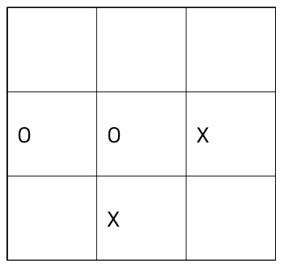
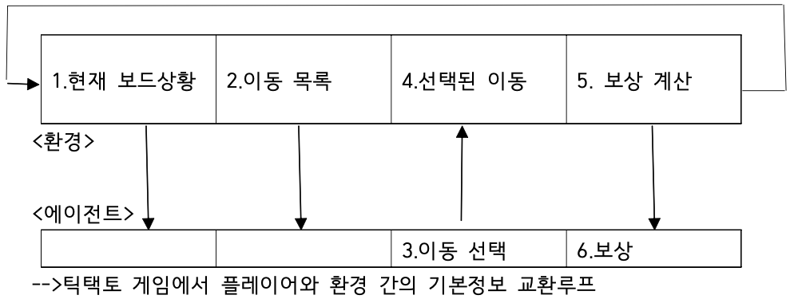
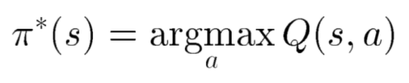
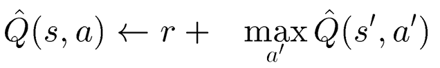
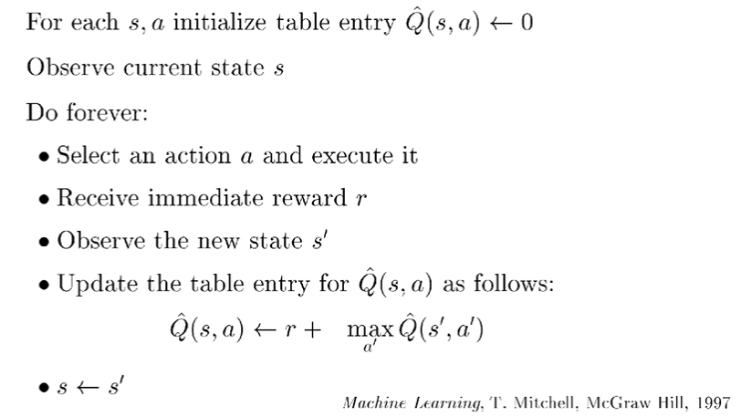

# AI+X 딥러닝
### Title: DQN을 통한 mnk-game 파훼

__Members__:     
김기범, 서울 기계공학부, gbkim1997@gmail.com    
박민기, 서울 기계공학부, mgkid3310@naver.com    
오하은, 서울 컴퓨터소프트웨어학부, haeunoh.tech@gmail.com     
길준호, 에리카 전자공학부, gjh625com@naver.com 
 
__Ⅰ. Proposal (Option A)__            
* Motivation:    
2016년 3월 9일부터 15일까지 한국에서 알파고와 한국의 프로 기사인 이세돌 九 단이 바둑 대국을 진행했었다. 알파고는 알파벳의 구글 딥마인드에서 개발한 바둑 인공지능 프로그램인데, 이 대국에서 알파고는 이세돌 九 단을 4:1로 이기는 성과를 보였다. 이 일을 계기로 인공지능이 사회 보편적으로 알려지게 되었는데, 이러한 인공지능에 대한 관심에 힘입어 구체적으로 이런 인공지능 프로그램이 어떻게 작동하는지 그 원리를 이해해 보고 직접 해당 프로그램을 구현해 보고자 **DQN(Deep Q-Network)를 통한 mnk-game 파훼**라는 주제로 이번 프로젝트를 진행하기로 하였다.  
    
* What do you want to see at the end?   
mnk-game에서 k가 1, 2, 3인 경우에 확실한 파훼법이 존재하는데, k=4인 경우에는 명백한 파훼법이 존재하지 않으므로 이 경우에 대해서 DQN(Deep Q-Network)를 이용해 최선의 전략을 제공할 수 있는 모델을 완성하는 것을 이번 프로젝트의 목적으로 한다.      

__Ⅱ. Theoretical background__
 * 강화학습 (Reinforcement Learning)
 * Q-러닝 (Q-Learning)
 * 인공 신경망 (Neural Network)
 * DQN (Deep Q-Network) 
 * CNN (Convolutional Neural Network)
## 강화학습 (Reinforcement Learning)
### 강화 학습 정의 
강화 학습은 기계 학습의 한 영역이다. 행동심리학에서 영감을 받았으며, 어떤 환경 안에서 정의된 에이전트가 현재의 상태를 인식하여, 선택 가능한 행동들 중 보상을 최대화하는 행동 혹은 행동 순서를 선택하는 방법이다.
### 강화학습 기본 아이디어
머신러닝 시스템을 훈련하는 방법에는 여러 가지가 있다. 레이블이 지정된 표본 집합이 있으면 지도학습을 사용해 각 샘플에 대한 올바른 레이블을 예측하도록 컴퓨터를 가르칠 수 있다. 피드백을 제공할 수 없을 때는 비지도학습을 사용해 컴퓨터가 최선을 다하게 할 수 있다. 그러나 때로는 이 두 가지 사이의 어딘가에 있을 때가 있다. 시스템이 무엇을 배우기를 원하는 지 알고는 있지만 그것이 샘플에 레이블을 붙이는 것만큼 명확하지는 않다. 알 수 있는 것은 그저 더 나은 솔루션과 더 나쁜 솔루션을 구분하는 방법뿐이다.

예를 들어 새로운 종류의 인간 로봇에게 두 발로 걷는 방법을 가르치려고 할 수 있다. 그 로봇이 어떻게 균형을 잡아야 하고 어떻게 움직여야 하는지 정확히 알진 못하지만 넘어지지 않고 똑바로 서 있기를 원한다는 것은 알고있다. 로봇이 배로 미끄러지거나 한쪽 다리로 뛰려고 하면 그것이 올바른 진행방향이 아니라고 말할 수 있다. 두 다리가 땅에 닿은 상태에서 시작 해 앞으로 나아가고자 다리를 사용한다면 올바른 방향으로 가고 있다고 말할 수 있고 이러한 종류의 행동을 계속 탐색할 수 있다. 개선이라고 인식하는 것에 대한 이러한 보상 전략을 강화학습 이라고 한다. 이 용어는 특정 알고리즘이 아니라 학습에 대한 일반적인 접근 방식을 설명한다.

친구와 체커 게임을 하고 있고 당신의 차례라고 가정해보자.

이 때 당신은 가진 말 중 하나를 움직일 수 있고 친구는 기다려야 한다. 강화학습에서는 행동의 선택권을 갖고 있기 때문에 이때 당신은 **행위자** 또는 **에이전트**이다. 그 공간의 다른 모든 것 (보드, 말, 규칙, 친구 등...)은 함께 환경으로 뭉뚱그려진다. 이러한 역할은 고정돼 있지 않다. 친구가 움직일 차례가 되면 그 친구가 에이전트가 되며 보드게임관, 말, 규칙, 심지어 당신까지 포함한 모든 것이 이제 환경의 일부가 된다.
행위자나 에이전트가 행동을 선택하면 환경이 바뀐다. 체커 게임에서 당신이 행위자라면 당신의 말 중 하나를 움직이고 상대방의 말 중 일부를 제거할 수 있다. 그 결과로 세상이 바뀌었다. 강화학습에서는 에이전트의 행동 후에 선호하는 기준을 사용해 행동이 얼마나 좋았는지 알려주는 보상이라고도 하는 피드백을 받는다. 피드백이나 보상은 일반적으로 하나의 숫자다.

피드백은 이 세상을 만들고 있는 행위자가 원하는 모든 것을 의미할 수 있다. 예를들어 체커 게임에서 게임을 이기는 움직임에는 큰 보상이 할당되고 지는 움직임에는 큰 부정적인 벌칙이 부과된다. 그 사이에는 움직임이 승리로 이어지는것처럼 보일수록 보상이 커진다.

시행착오를 통해 에이전트는 다양한 상황에서 다른 것보다 나은 행동을 발견할수 있으며 경험을 쌓으면서 점차 더 나은 선택을 할 수 있다. 이 접근 방식은 항상 최선의 방법을 알지 못하 는 상황에 특히 효과적이다.

강화학습은 불확실성을 모델링하는 좋은 방법을 제공한다. 간단한 규칙 기반 게임에서는 원칙 적으로 다른 플레이어가 항상 같은 행동을 한다고 가정해 모든 게임 상황을 평가하고 최상의 움직임을 선택할 수 있다. 그러나 현실 세계에서는 다른 플레이어들이 놀라운 행동을 하기도 한다. 그리고 어떤 날에는 다른 날보다 더 많은 사람이 엘리베이터를 필요로 하는 현실 세계 를 다룰 때 놀라움에도 불구하고 계속해서 잘 수행할 수 있는 전략을 갖고 있어야 한다. 강화 학습은 이러한 상황에서 좋은 선택이 될 수 있다.

### 틱택토 구현에 관한 강화학습
강화학습을 사용해 프로그램에 틱택토를 플레이하는 방법을 가르치는 단계를 살펴보겠다.

플레이하려면 플레이어가 3×3 격자 셀에 X 또는 O를 교대로 배치하고 연속으로 3개의 기호 를 먼저 두는 사람이 승자가 된다. 플레이어는 O로, 컴퓨터 학습기는 X로 플레이한다.

 

이 시나리오에서 훈련하는 프로그램은 에이전트다. 게임과 게임 방법에 대해 모두 알고 있는 다른 프로그램에서 시뮬레이션할 수 있는 환경에 대해 게임을 하고 있다. 에이전트는 게임의 규칙, 이기거나 지는 방법, 이동 방법조차도 모른다. 하지만 에이전트는 완전히 어둠 속에 있 지는 않을 것이다. 각 에이전트의 턴이 시작될 때 환경은 에이전트에게 두 가지 중요한 정보, 즉 현재 보드의 상황과 사용할 수 있는 이동 목록을 제공한다.

 

3단계에서 에이전트는 원하는 방법에 따라 이동을 선택한다. 예를 들자면 무작위로 선택하거나, 온라인 리소스를 참조하거나 이전 게임의 자체 메모리를 사용할 수 있다. 강화학습의 도전 과제 중 일부는 사용할 수 있는 리소스로 좋은 작업을 수행하는 에이전트를 설계하는 것이다.

에이전트가 이동을 선택하면 4단계에서 이를 환경에 전달한다. 그런 다음 환경은 5단계를 따 르고 선택한 셀에 X를 배치해 실제로 이동을 시작한다. 그런 다음환경은 에이전트가 이겼는지 확인한다. 에이전트가 이겼다면 보상을 큰 것으로 설정한다.

그렇지 않으면 이동이 에이전트에게 얼마나 좋은지에 따라 보상을 계산한다.
이제 다른 플레이어를 시뮬레이션하는 환경이 자체적으로 움직인다. 이기면 보상을 매우 낮게 변경한다. 게임이 환경이나 에이전트의 이동으로 인해 종료된 경우 보상을 궁극적인 보상 또 는 최종 보상이라고 한다. 6단계에서 환경은 에이전트에게 보상을 전송해 에이전트가 선택한 이동이 얼마나 좋은지 알 수 있게 한다. 아무도 이기지 못했다면 루프의 시작 부분으로 돌아 가고 에이전트는 다음 턴을 시작한다.
## Q-러닝 (Q-Learning)
Q 러닝은 주어진 환경에서 주어진 행동을 수행하는 것이 가져다주는 효용의 기대값을 예측하는 함수인 Q 함수를 학습함으로써 최적의 정책을 학습한다. 정책이란 주어진 상태에서 어떤 행동을 수행할지 나타내는 규칙이다. Q 함수를 학습하고 나면 각 상태에서 최고의 Q(현재 상태에서 취한 행동의 보상에 대한 퀄리티)를 주는 행동을 수행함으로써 최적의 정책을 유도할 수 있다. Q 러닝의 장점 중 하나는 주어진 환경의 모델 없이도 수행하는 행동의 기대값을 비교할 수 있다는 점이다. 뿐만 아니라 Q 러닝은 전이가 확률적으로 일어나거나 보상이 확률적
으로 주어지는 환경에서도 별다른 변형 없이 적용될 수 있다는 것이 장점이다.
### Q-러닝 원리
Q에 내가 가진 환경과 행동을 주면 Q는 이런 환경에서 이런 행동을 하면 얼마큼의 보상을 받을 수 있는지 알려준다. 알려준 값에 에이전트는 최대값을 주는 행동을 찾아 그 행동을 한다.

 

여기서 최댓값을 주는 행동을 주로 π로 표현한다 argmax는 Q(s,a)를 최대로 하는 action을 찾는다는 뜻이다. π옆에 붙은 *는 최적의 값임을 말하는 데 Q를 최대로 하는 action을 취하는 정책이 최적임을 의미한다.

 

에이전트는 현재 s라는 상태이고 a라는 액션을 취한다. 그러면 에이전트의 상태는 s'으로 변 하게 된다. a라는 액션을 취했을 때 에이전트는 r이라는 보상을 받게 된다. s 상태에서 Q 값 은 모르지만 s' 상태에서의 Q는 알고 있다고 가정하는 것이다. 그리고 위의 수식을 반복하여 Q를 학습한다.
 
    
### Q-알고리즘

## 인공 신경망 (Neural Network)
__Ⅲ. Datasets__     
 * m, n, k = 5, 5, 4
        
__Ⅳ. Methodology__
 * input layer: m*n
 * dense 2*m*n relu
 * output m*n linear
 * tkinter

__Ⅴ. Evaluation & Analysis__      

__Ⅵ. Related Work__
 * https://ko.wikipedia.org/wiki/M,n,k-%EA%B2%8C%EC%9E%84
 * https://github.com/bruiseUneo/AI_X_DeepLearning
 * [Deep Learning: A Visual Approach(Andrew Glassner)](https://www.glassner.com/portfolio/deep-learning-a-visual-approach/)
 * https://spacebike.tistory.com/53?category=978529

__Ⅶ. Conclusion: Discussion__
