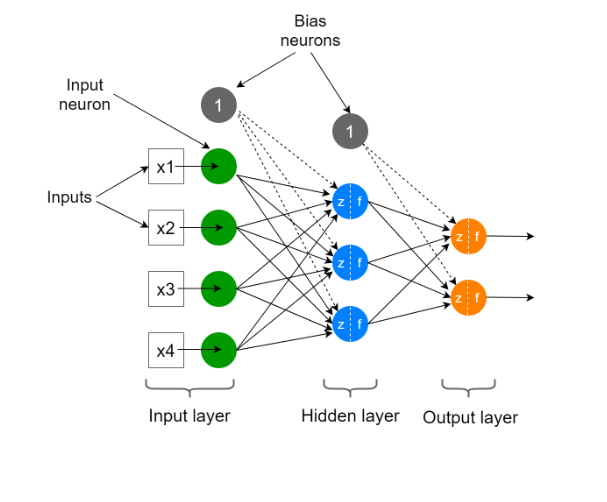
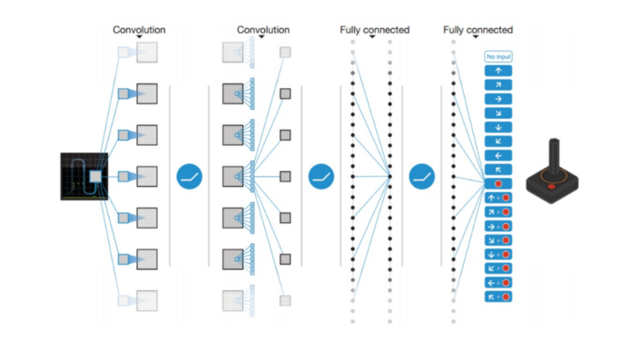
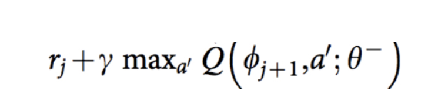
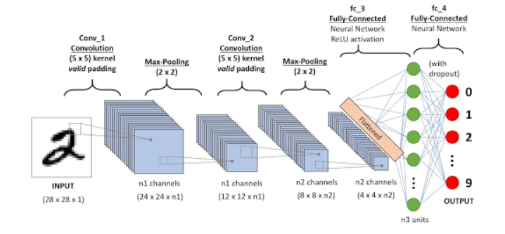

# AI+X 딥러닝
### Title: DQN을 통한 mnk-game 파훼

__Members__:     
김기범, 서울 기계공학부, gbkim1997@gmail.com    
박민기, 서울 기계공학부, mgkid3310@naver.com    
오하은, 서울 컴퓨터소프트웨어학부, haeunoh.tech@gmail.com     
길준호, 에리카 전자공학부, gjh625com@naver.com 
 
__Ⅰ. Proposal (Option A)__            
* Motivation:    
 2016년 3월 9일부터 15일까지 한국에서 알파고와 한국의 프로 기사인 이세돌 九 단이 바둑 대국을 진행했었다. 알파고는 알파벳의 구글 딥마인드에서 개발한 바둑 인공지능 프로그램인데, 이 대국에서 알파고는 이세돌 九 단을 4:1로 이기는 성과를 보였다. 이 일을 계기로 인공지능이 사회 보편적으로 알려지게 되었는데, 이러한 인공지능에 대한 관심에 힘입어 구체적으로 이런 인공지능 프로그램이 어떻게 작동하는지 그 원리를 이해해 보고 직접 해당 프로그램을 구현해 보고자 **DQN(Deep Q-Network)를 통한 mnk-game 파훼**라는 주제로 이번 프로젝트를 진행하기로 하였다.  
    
* What do you want to see at the end?   
 mnk-game에서 k가 1, 2, 3인 경우에 확실한 파훼법이 존재하는데, k=4인 경우에는 명백한 파훼법이 존재하지 않으므로 이 경우에 대해서 DQN(Deep Q-Network)를 이용해 최선의 전략을 제공할 수 있는 모델을 완성하는 것을 이번 프로젝트의 목적으로 한다.      

__Ⅱ. Theoretical background__
 * 강화학습 (Reinforcement Learning)
 * Q-러닝 (Q-Learning)
 * 인공 신경망 (Neural Network)
 * DQN (Deep Q-Network) 
 * CNN (Convolutional Neural Network)
## 강화학습 (Reinforcement Learning)
### 강화 학습 정의 
 강화 학습은 기계 학습의 한 영역이다. 행동심리학에서 영감을 받았으며, 어떤 환경 안에서 정의된 에이전트가 현재의 상태를 인식하여, 선택 가능한 행동들 중 보상을 최대화하는 행동 혹은 행동 순서를 선택하는 방법이다.
### 강화학습 기본 아이디어
 머신러닝 시스템을 훈련하는 방법에는 여러 가지가 있다. 레이블이 지정된 표본 집합이 있으면 지도학습을 사용해 각 샘플에 대한 올바른 레이블을 예측하도록 컴퓨터를 가르칠 수 있다. 피드백을 제공할 수 없을 때는 비지도학습을 사용해 컴퓨터가 최선을 다하게 할 수 있다. 그러나 때로는 이 두 가지 사이의 어딘가에 있을 때가 있다. 시스템이 무엇을 배우기를 원하는 지 알고는 있지만 그것이 샘플에 레이블을 붙이는 것만큼 명확하지는 않다. 알 수 있는 것은 그저 더 나은 솔루션과 더 나쁜 솔루션을 구분하는 방법뿐이다.

 예를 들어 새로운 종류의 인간 로봇에게 두 발로 걷는 방법을 가르치려고 할 수 있다. 그 로봇이 어떻게 균형을 잡아야 하고 어떻게 움직여야 하는지 정확히 알진 못하지만 넘어지지 않고 똑바로 서 있기를 원한다는 것은 알고있다. 로봇이 배로 미끄러지거나 한쪽 다리로 뛰려고 하면 그것이 올바른 진행방향이 아니라고 말할 수 있다. 두 다리가 땅에 닿은 상태에서 시작 해 앞으로 나아가고자 다리를 사용한다면 올바른 방향으로 가고 있다고 말할 수 있고 이러한 종류의 행동을 계속 탐색할 수 있다. 개선이라고 인식하는 것에 대한 이러한 보상 전략을 강화학습 이라고 한다. 이 용어는 특정 알고리즘이 아니라 학습에 대한 일반적인 접근 방식을 설명한다.

 친구와 체커 게임을 하고 있고 당신의 차례라고 가정해보자.

 이때 당신은 가진 말 중 하나를 움직일 수 있고 친구는 기다려야 한다. 강화학습에서는 행동의 선택권을 갖고 있기 때문에 이때 당신은 **행위자** 또는 **에이전트**이다. 그 공간의 다른 모든 것 (보드, 말, 규칙, 친구 등...)은 함께 환경으로 뭉뚱그려진다. 이러한 역할은 고정돼 있지 않다. 친구가 움직일 차례가 되면 그 친구가 에이전트가 되며 보드게임관, 말, 규칙, 심지어 당신까지 포함한 모든 것이 이제 환경의 일부가 된다.
행위자나 에이전트가 행동을 선택하면 환경이 바뀐다. 체커 게임에서 당신이 행위자라면 당신의 말 중 하나를 움직이고 상대방의 말 중 일부를 제거할 수 있다. 그 결과로 세상이 바뀌었다. 강화학습에서는 에이전트의 행동 후에 선호하는 기준을 사용해 행동이 얼마나 좋았는지 알려주는 보상이라고도 하는 피드백을 받는다. 피드백이나 보상은 일반적으로 하나의 숫자다.

 피드백은 이 세상을 만들고 있는 행위자가 원하는 모든 것을 의미할 수 있다. 예를들어 체커 게임에서 게임을 이기는 움직임에는 큰 보상이 할당되고 지는 움직임에는 큰 부정적인 벌칙이 부과된다. 그 사이에는 움직임이 승리로 이어지는것처럼 보일수록 보상이 커진다.

 시행착오를 통해 에이전트는 다양한 상황에서 다른 것보다 나은 행동을 발견할수 있으며 경험을 쌓으면서 점차 더 나은 선택을 할 수 있다. 이 접근 방식은 항상 최선의 방법을 알지 못하 는 상황에 특히 효과적이다.

 강화학습은 불확실성을 모델링하는 좋은 방법을 제공한다. 간단한 규칙 기반 게임에서는 원칙 적으로 다른 플레이어가 항상 같은 행동을 한다고 가정해 모든 게임 상황을 평가하고 최상의 움직임을 선택할 수 있다. 그러나 현실 세계에서는 다른 플레이어들이 놀라운 행동을 하기도 한다. 그리고 어떤 날에는 다른 날보다 더 많은 사람이 엘리베이터를 필요로 하는 현실 세계 를 다룰 때 놀라움에도 불구하고 계속해서 잘 수행할 수 있는 전략을 갖고 있어야 한다. 강화 학습은 이러한 상황에서 좋은 선택이 될 수 있다.
### 틱택토 구현에 관한 강화학습
 강화학습을 사용해 프로그램에 틱택토를 플레이하는 방법을 가르치는 단계를 살펴보겠다.

 플레이하려면 플레이어가 3×3 격자 셀에 X 또는 O를 교대로 배치하고 연속으로 3개의 기호 를 먼저 두는 사람이 승자가 된다. 플레이어는 O로, 컴퓨터 학습기는 X로 플레이한다.

 

 이 시나리오에서 훈련하는 프로그램은 에이전트다. 게임과 게임 방법에 대해 모두 알고 있는 다른 프로그램에서 시뮬레이션할 수 있는 환경에 대해 게임을 하고 있다. 에이전트는 게임의 규칙, 이기거나 지는 방법, 이동 방법조차도 모른다. 하지만 에이전트는 완전히 어둠 속에 있 지는 않을 것이다. 각 에이전트의 턴이 시작될 때 환경은 에이전트에게 두 가지 중요한 정보, 즉 현재 보드의 상황과 사용할 수 있는 이동 목록을 제공한다.

 

 3단계에서 에이전트는 원하는 방법에 따라 이동을 선택한다. 예를 들자면 무작위로 선택하거나, 온라인 리소스를 참조하거나 이전 게임의 자체 메모리를 사용할 수 있다. 강화학습의 도전 과제 중 일부는 사용할 수 있는 리소스로 좋은 작업을 수행하는 에이전트를 설계하는 것이다.

 에이전트가 이동을 선택하면 4단계에서 이를 환경에 전달한다. 그런 다음 환경은 5단계를 따 르고 선택한 셀에 X를 배치해 실제로 이동을 시작한다. 그런 다음환경은 에이전트가 이겼는지 확인한다. 에이전트가 이겼다면 보상을 큰 것으로 설정한다.

 그렇지 않으면 이동이 에이전트에게 얼마나 좋은지에 따라 보상을 계산한다.
 이제 다른 플레이어를 시뮬레이션하는 환경이 자체적으로 움직인다. 이기면 보상을 매우 낮게 변경한다. 게임이 환경이나 에이전트의 이동으로 인해 종료된 경우 보상을 궁극적인 보상 또 는 최종 보상이라고 한다. 6단계에서 환경은 에이전트에게 보상을 전송해 에이전트가 선택한 이동이 얼마나 좋은지 알 수 있게 한다. 아무도 이기지 못했다면 루프의 시작 부분으로 돌아 가고 에이전트는 다음 턴을 시작한다.
## Q-러닝 (Q-Learning)
 Q 러닝은 주어진 환경에서 주어진 행동을 수행하는 것이 가져다주는 효용의 기대값을 예측하는 함수인 Q 함수를 학습함으로써 최적의 정책을 학습한다. 정책이란 주어진 상태에서 어떤 행동을 수행할지 나타내는 규칙이다. Q 함수를 학습하고 나면 각 상태에서 최고의 Q(현재 상태에서 취한 행동의 보상에 대한 퀄리티)를 주는 행동을 수행함으로써 최적의 정책을 유도할 수 있다. Q 러닝의 장점 중 하나는 주어진 환경의 모델 없이도 수행하는 행동의 기대값을 비교할 수 있다는 점이다. 뿐만 아니라 Q 러닝은 전이가 확률적으로 일어나거나 보상이 확률적으로 주어지는 환경에서도 별다른 변형 없이 적용될 수 있다는 것이 장점이다.
### Q-러닝 원리
 Q에 내가 가진 환경과 행동을 주면 Q는 이런 환경에서 이런 행동을 하면 얼마큼의 보상을 받을 수 있는지 알려준다. 알려준 값에 에이전트는 최대값을 주는 행동을 찾아 그 행동을 한다.

 

 여기서 최댓값을 주는 행동을 주로 π로 표현한다 argmax는 Q(s,a)를 최대로 하는 action을 찾는다는 뜻이다. π옆에 붙은 *는 최적의 값임을 말하는 데 Q를 최대로 하는 action을 취하는 정책이 최적임을 의미한다.

 

 에이전트는 현재 s라는 상태이고 a라는 액션을 취한다. 그러면 에이전트의 상태는 s'으로 변 하게 된다. a라는 액션을 취했을 때 에이전트는 r이라는 보상을 받게 된다. s 상태에서 Q 값 은 모르지만 s' 상태에서의 Q는 알고 있다고 가정하는 것이다. 그리고 위의 수식을 반복하여 Q를 학습한다. 
### Q-알고리즘

## 인공 신경망 (Neural Network)
 인공 신경망을 이해하기 위해 우선 인공 뉴런에 대해 설명하고자 한다. 
 
 인공 뉴런(Artificial Neuron)은 Perceptron, Unit, Node라고도 불리는데, 이는 생물학에서의 뉴런이라는 신경세포 모형에서부터 영감을 얻어 만들어진 모델이다. 인공 뉴런은 가중치가 곱해진 입력 값들의 합과 활성화 함수로 구성되어 있다. 
 
 활성화 함수는 비선형 분류를 가능하게 하고자 도입된 함수이다. 현실 세계의 data의 많은 관계들은 비선형이기 때문에 인공 신경망에서 활성화 함수의 역할은 매우 중요하다. 활성화 함수의 종류로는 sigmoid, tanh, ReLU, Leaky ReLU, Maxout, ELU 등이 있다. 
 
 인공 뉴런 하나를 사용하면 선형 분류가 가능하고 최적화된 결정 경계를 찾아 두 개의 다른 클래스를 분류한다. 그러나 이렇게 인공 뉴런 하나만을 사용하면 비선형 문제를 해결할 수 없는데, 이를 보완하려는 목적으로 인공 신경망이라는 개념이 도입됐다. 인공 뉴런은 인공 신경망의 가장 단순한 구성요소인데, 이런 인공 뉴런들을 여러 층으로 구성하여 비선형 문제를 해결하는 수학적 모델이 인공 신경망이다.

 인공 신경망은 인공 뉴런들이 여러 층으로 구성되어 있는 특징으로부터 Multi-Layer Perceptron(MLP)라는 이름을 가지고 있으며, 각 층의 각각의 인공 뉴런이 다음 층의 각각의 인공 뉴런에 연결되어 있는 특징으로부터 Fully(Densely) Connected Neural Network(FCNN)이라는 이름도 가지고 있다.

 인공 신경망은 크게 Input layer, Hidden (invisible) layer, Output layer으로 구성되어 있다. 위의 그림처럼 Hidden layer가 하나인 경우의 인공 신경망을 Shallow Neural Network라 하고, Hidden layer가 두 개 이상인 경우의 인공 신경망을 Deep Neural Network라 한다. 

 Input layer는 input neuron들로 구성되어 있고 이 뉴런들은 x1, x2 등과 같은 input 값을 입력받는다. Input neuron들은 input data를 그저 보존한다. Bias 뉴런은 항상 1의 값을 출력한다. Input layer는 그 종류가 다양한데, 가장 유명한 것으로는 Dense(FC, Fully Connected), Convolutional, Recurrent가 있다. Input layer의 종류에 따라 input data의 크기가 결정된다. Input neuron들은 항상 숫자 값을 입력받는다. 그리고 이러한 숫자 값들은 tensor의 형태로 배열된다. Dense input layer에서는 input layer의 크기가 input data의 feature (column)의 수와 동일하다. 이것들은 first hidden layer의 첫 번째 입력 값들이고 가중치를 통해 hidden layer에 있는 뉴런들과 fully connected된다. Input layer의 크기는 훈련 전에 모델에서 특정되어야 할 하이퍼파라미터이다.

 또한, deep neural network에서 hidden layer의 수는 프로그램을 설계하는 사람이 직접 정해야 하는 하이퍼파라미터이다. Hidden layer의 수는 인공 신경망의 깊이를 측정한다. Hidden layer의 수가 증가할수록 인공 신경망은 data의 더 복잡한 관계를 모델링 할 수 있다. 그러나 모델이 훈련을 하는데 시간이 오래 걸리며 과적합의 문제가 발생할 수 있다. 과적합은 인공 신경망이 훈련 data에 과하게 훈련된 상태를 뜻한다.

 Output layer는 최종 예측을 수행하는 output neuron들로 구성되어 있다. Output layer의 크기도 프로그램을 설계하는 사람이 직접 정하는 하이퍼파라미터이다. 이 크기는 해결하고자 하는 문제의 종류에 따라 결정된다. 대표적으로는 Binary Classification, Multi-class classification, Multi-label classification, Regression이 있다.

## DQN (Deep Q-Network)
 Q-러닝은 매우 강력한 알고리즘이긴 하지만, 일반성이 부족하다는 주된 취약점을 가지고 있다. Q-러닝 에이전트는 이전에 보지 못한 상태에 대해서 어떤 행동을 취해야 하는지에 대한 단서가 없다. 즉, Q-러닝 에이전트는 이전에 보지 못한 상태에 대해서 Q 값을 측정할 능력이 없다. 이러한 문제를 해결하기 위해 DQN은 2차원 배열 대신에 신경망을 도입한다. 

 

 2013년에 DeepMind사는 위의 그림과 같이 Atari game에 DQN을 적용했다. Input data는 현재 게임 상황에 대한 미가공의 그림이었고, 이는 convolutional layer뿐만 아니라 fully connected layer를 포함하는 여러 층을 통과하였다. 그리고 Output data는 에이전트가 취할 수 있는 각각의 행동에 대한 Q 값이었다. DQN에서 network는 Q-러닝 update equation을 통해 훈련한다.

 
 Q-러닝에 대한 목표 Q 값은 위 그림과 같다.  ϕ는 상태 s와 동일하고, 𝜽는 신경망의 가중치 값을 나타낸다. 따라서 신경망에 대한 손실 함수는 목표 Q 값과 network로부터의 Q 값 output 사이의 제곱 오차로 정의된다.
 
**DQN Pseudo Code:**

 

 DQN을 훈련하기 위해서 다음의 두 가지 기술들이 또한 필요하다. 첫 번째는 experience replay이다. 전형적인 강화학습 구성에서 훈련 표본들은 매우 상관되어 있고, data 효율이 낮기 때문에, 신경망이 훈련 표본들을 수렴하기 어렵다. 표본 분배 문제를 해결하기 위해서 experience replay memory를 만들고 experience를 저장한 후 랜덤하게 뽑아서 학습한다. 이를 통해 덜 상관되어 있고 고르게 분포된 data로 학습할 수 있게 된다. 두 번째는 서로 다른 목표 network를 사용하는 것이다. 목표 Q Network는 추정 값과 같은 구조를 가지고 있다. 위의 pseudo code를 보면, 매번의 C 단계에서 목표 network는 다른 것으로 변경된다. 따라서 변동이 덜 심해지고, 보다 안정적인 훈련을 할 수 있게 된다.
 
## CNN (Convolutional Neural Network)
 CNN(Convolutional Neural Network)는 이미지를 딥러닝 모델에 적용하기 위해 고안된 알고리즘이다. 이전에는 Multi-layered network를 딥러닝 모델로 사용했었는데, 이를 사용할 경우 아무리 작은 이미지라고 할지라도 하나에 200개가 넘는 픽셀을 가지고 있기 때문에 학습될 파라미터의 수가 수만 개가 넘는다. 따라서 Multi-layered network를 사용할 경우 모델의 학습 시간이 매우 길어지고 신경망의 크기가 커지며 변수의 개수가 커진다는 문제가 발생한다. 그리고 가장 큰 문제는 Multi-layered network가 이미지의 기하학적 특징을 전혀 학습하지 못한다는 것이다. 이러한 문제들을 해결하면서 이미지를 학습하기 위해 고안된 알고리즘이 바로 CNN이다.

 
 
 CNN은 크게 convolution, sub-sampling, fully-connected layer의 세 가지 부분으로 이루어져 있다.

 Convolution은 filter (혹은 kernel)을 사용해서 이미지의 특징을 추출하는 단계를 말한다. 즉, 이미지와 filter의 합성곱(convolution) 연산으로 이미지의 특징을 추출하는 단계이다. Convolution layer 단계의 목적은 filter을 학습시키는 것이다. 즉, filter에 들어가는 숫자를 사람이 지정하는 것이 아니라, filter 값들이 back propagation을 통해 optimized 될 수 있게 하는 것이 CNN의 주된 목적이다. 5x5 이미지, 3x3 filter, stride = 1에 대한 convolution 연산을 수행하면 3x3 크기의 이미지를 갖게 되는데, 이렇게 convolution 연산은 그 수행 과정에서 반드시 이미지의 크기가 줄어들게 된다. 이는 이미지의 정보를 잃게 되는 불이익을 가져다주는데, 이럴 경우 보통 주변에 0과 같은 의미없는 값을 넣어 1픽셀씩 키워주면 원래의 이미지 크기를 유지한다. 이런 방법을 Padding이라 하며, 0으로 테두리를 추가한 경우를 zero padding이라 부른다. 일반적으로 이미지에서 여러 개의 다른 특징들을 찾아내기 위해 CNN에서는 여러 개의 filter를 사용한다.

 Sub-sampling(Pooling)는 이미지의 topology 변화에 영향을 받지 않게 하기 위해 window 내에서 대표값만 기억하는 단계이다. 일반적으로 sub-sampling은 window의 특정 위치값이나 평균값(average pooling)을 사용하는데, 신경망에서는 최대값(max pooling)을 주로 사용한다. 실제 신경세포학적으로 보통 시신경의 강한 신호만 살아남고 나머지는 무시되기 때문이다.
 
 입력값이 convolution layer, sub-sampling layer를 거치면 local feature를 찾을 수 있다. 그리고 그 과정을 반복하면 global feature를 찾을 수 있는데, fully-connected layer는 이 global feature를 학습하는 단계이다.

__Ⅲ. Datasets__     
 * m, n, k = 5, 5, 4
        
__Ⅳ. Methodology__
 * input layer: m*n
 * dense 2*m*n relu
 * output m*n linear
 * tkinter

__Ⅴ. Evaluation & Analysis__      

__Ⅵ. Related Work__
 * https://ko.wikipedia.org/wiki/M,n,k-%EA%B2%8C%EC%9E%84
 * https://github.com/bruiseUneo/AI_X_DeepLearning
 * [Deep Learning: A Visual Approach(Andrew Glassner)](https://www.glassner.com/portfolio/deep-learning-a-visual-approach/)
 * https://spacebike.tistory.com/53?category=978529
 * https://towardsdatascience.com/the-concept-of-artificial-neurons-perceptrons-in-neural-networks-fab22249cbfc
 * https://rukshanpramoditha.medium.com/one-hidden-layer-shallow-neural-network-architecture-d45097f649e6
 * https://medium.com/towards-data-science/introduction-to-various-reinforcement-learning-algorithms-i-q-learning-sarsa-dqn-ddpg-72a5e0cb6287
 * https://sonsnotation.blogspot.com/2020/11/7-convolutional-neural-networkcnn.html

__Ⅶ. Conclusion: Discussion__
